# Tantra: A Systematic Guide

### *From Shiva–Shakti to Sadhana — a layman's paper on the principles, lineages, subtle anatomy, and living path of Tantra*

---

> **Abstract.** Tantra is one of the world's most complete "technologies of consciousness" — a
> practical system for realizing the divine *inside embodied life* rather than by escaping it. This
> paper assembles, in a single systematic arc, the ideas a curious beginner most needs: the
> Shiva–Shakti principle, the origin of Tantra in the Agamas/Nigamas, the two great Goddess-families
> (**Kali Kula** and **Shri Kula / Shri Vidya**), the map of the human being (five **koshas**, three
> bodies), the subtle body (**nadis, chakras, granthis, kundalini**), how this relates to **Patanjali's
> Ashtanga Yoga**, the power of **mantra** and **beej** seeds, the **guru–shishya** transmission, a
> concrete guide to **starting sadhana**, and the twin goal of **bhukti and mukti** (enjoyment *and*
> liberation). Diagrams are included throughout to make each idea visual. It is a study map, not a
> replacement for a living teacher. Raw sources: [`RAW-RESEARCH-NOTES.md`](./RAW-RESEARCH-NOTES.md).

> **How to read the diagrams.** Visuals are written in **Mermaid**, which renders automatically on
> GitHub, GitLab, Obsidian, Notion, and VS Code (with a Markdown-Mermaid extension). If you're viewing
> in a plain text editor, the diagrams appear as code — install a Mermaid-capable viewer, or read the
> labels top-to-bottom; each is also explained in the surrounding text.

---

## Table of Contents

1. [Orientation — the Big Picture in One Diagram](#1-orientation--the-big-picture-in-one-diagram)
2. [What "Tantra" Means](#2-what-tantra-means)
3. [The Core Principles of Tantra](#3-the-core-principles-of-tantra)
4. [Shiva and Shakti — the Two-in-One](#4-shiva-and-shakti--the-two-in-one)
5. [Origin of Tantra — Agama, Nigama, and the Texts](#5-origin-of-tantra--agama-nigama-and-the-texts)
6. [The Two Great Families: Kali Kula and Shri Kula](#6-the-two-great-families-kali-kula-and-shri-kula)
7. [Kali Kula — the Krama and the Fierce Goddess](#7-kali-kula--the-krama-and-the-fierce-goddess)
8. [Shri Vidya — the Sri Chakra and Lalita Tripura Sundari](#8-shri-vidya--the-sri-chakra-and-lalita-tripura-sundari)
9. [Devi and the Ten Mahavidyas](#9-devi-and-the-ten-mahavidyas)
10. [The Human Being: Five Koshas and Three Bodies](#10-the-human-being-five-koshas-and-three-bodies)
11. [The Subtle Body: Nadis, Chakras, Granthis](#11-the-subtle-body-nadis-chakras-granthis)
12. [Kundalini Shakti](#12-kundalini-shakti)
13. [Patanjali's Ashtanga Yoga and its Relation to Kundalini/Tantra](#13-patanjalis-ashtanga-yoga-and-its-relation-to-kundalinitantra)
14. [Mantra and the Beej (Seed) Mantras](#14-mantra-and-the-beej-seed-mantras)
15. [Guru–Shishya: Lineage and Diksha](#15-gurushishya-lineage-and-diksha)
16. [How to Start Sadhana](#16-how-to-start-sadhana)
17. [The Goal of Tantra: Bhukti and Mukti](#17-the-goal-of-tantra-bhukti-and-mukti)
18. [A Beginner's Roadmap (Master Flowchart)](#18-a-beginners-roadmap-master-flowchart)
19. [Glossary](#19-glossary)
20. [Reading List](#20-reading-list)

---

## 1. Orientation — the Big Picture in One Diagram

Before the details, here is the entire landscape on one page. Everything below is an expansion of a
box in this map.

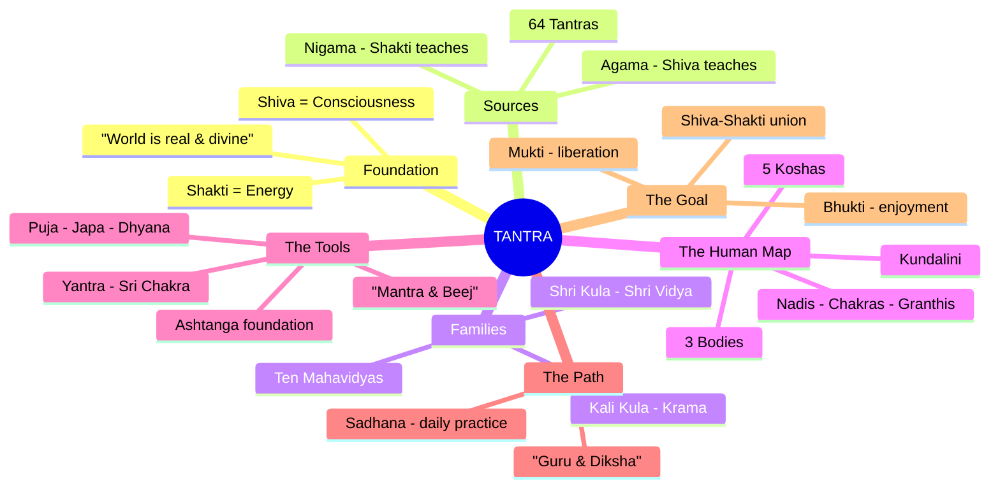

The single sentence that ties it together:

> **Tantra says: you are already the union of Consciousness (Shiva) and Energy (Shakti). Sadhana is
> the systematic work of *realizing* that — using the body, breath, sound, and the world itself —
> until living becomes liberation.**

---

## 2. What "Tantra" Means

The Sanskrit word **tantra** (तन्त्र) comes from the root *tan* ("to stretch, weave, expand") plus
*tra* ("instrument"). Two classic readings:

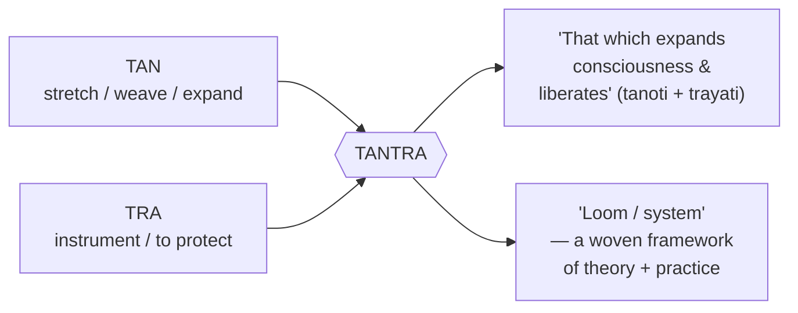

So Tantra is not a single religion but a **method** — a practical framework for realizing the divine
*within embodied life*. Its defining commitments:

- **The world is real and divine**, not merely an illusion to escape. Body, senses, energy, sound,
  and even desire become raw material for liberation.
- **Shakti (power/energy) is central.** Reality is Consciousness (Shiva) and its Energy (Shakti) in
  eternal union.
- **Practice over dogma** — mantra, yantra, mudra, nyasa, puja, visualization, and yoga are the engine.
- **A living transmission** — knowledge flows through *guru–shishya parampara* and *diksha*.

Tantra threads through Hindu (Shaiva, Shakta, Vaishnava), Buddhist (Vajrayana), and Jain streams.
This guide focuses on the **Hindu Shaiva–Shakta** stream — the home of Kali Kula, Shri Vidya,
chakras, and kundalini.

---

## 3. The Core Principles of Tantra

If Tantra were reduced to a set of working axioms — the "laws of physics" of the tradition — they
would be these. Everything else is application.

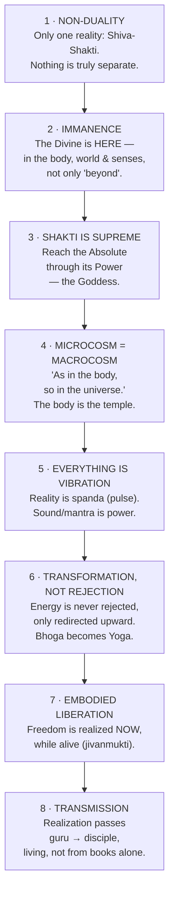

**In plain language:**

| Principle | What it means for you |
|-----------|------------------------|
| Non-duality | You are not separate from the divine; the search ends in *recognition*, not acquisition. |
| Immanence | You don't have to leave the world to find God — you look *more deeply into it*. |
| Shakti supreme | Energy, life-force, the feminine — these are doorways, not distractions. |
| Micro = macro | Working on yourself *is* working on the cosmos; the body is a laboratory. |
| Vibration | Sound (mantra) literally re-tunes your inner state; it is technology, not superstition. |
| Transformation | No part of you is "bad" — anger, desire, fear are fuel to be redirected. |
| Embodied freedom | You can be free *in this life*, not only after death. |
| Transmission | Find a real teacher; books orient you, a guru transmits. |

---

## 4. Shiva and Shakti — the Two-in-One

At the heart of Tantra is a **non-dual polarity** — one reality seen as still ground and dynamic
expression.

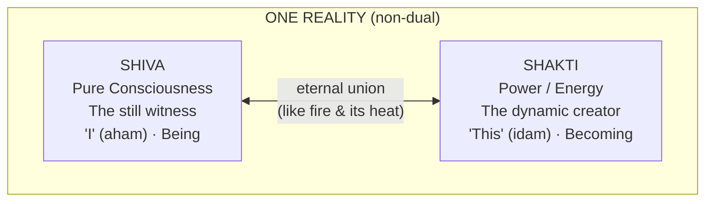

| | Shiva (शिव) | Shakti (शक्ति) |
|---|---|---|
| Principle | Pure consciousness, the witness | Power, energy, dynamism |
| Symbol | The still point, the *bindu* | The vibration, the *spanda* |
| Grammar | The "I" (aham) | The "This" (idam), manifestation |
| State | Being | Becoming |
| Image | The corpse (*shava*) without her | The one who animates and creates |

A famous line: **"Shiva without Shakti is *shava* (a corpse)."** Consciousness without its own power
cannot act, know, or will; Shakti without Shiva has no ground. They are **not two** — like fire and
its heat, or a word and its meaning.

**Everything is their play (līlā).** Universe, body, mind, sound, and seeker are all Shakti expressing
Shiva. The entire path is to *realize this union in oneself* — to let individual energy (kundalini)
rise and rejoin its source (Shiva) at the crown, and to recognize it was never actually separate.
This is why Tantra feels fundamentally **Shakta**: it approaches the Absolute through its **Power**,
personified as the **Goddess (Devi)**.

---

## 5. Origin of Tantra — Agama, Nigama, and the Texts

### The dialogue form

Tantric scriptures are cast as an intimate **dialogue between Shiva and Shakti**. Who is teaching
defines the class of text:

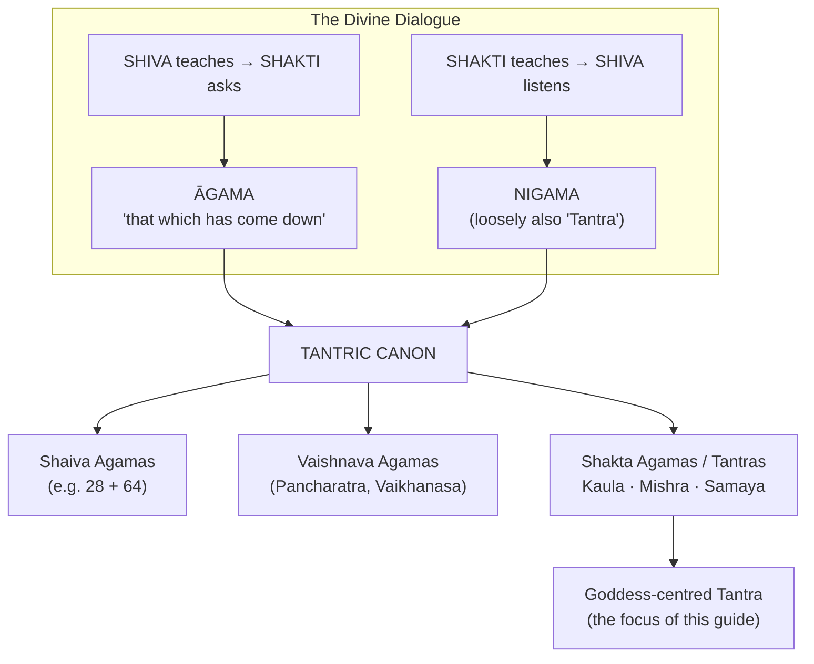

- **Āgama** — **Shiva teaches**, Shakti (Parvati/Devi) questions.
- **Nigama** — **Shakti teaches**, Shiva listens.

These texts present themselves as **revealed knowledge**, parallel to (and in Shaivism, as
authoritative as) the Vedas — the foundation of Shaiva, Shakta, and Tantric practice.

### Classification & timeline

A commonly cited traditional count is **64 Tantras** and related Agamas. By principal deity the
Agamas divide into **Shaiva, Vaishnava, and Shakta (Tantra)**; the Shakta stream subdivides into
**Kaula, Mishra, and Samaya**. Historically, recognizable Tantric systems crystallised in the
mid-first millennium CE and flowered c. **8th–12th centuries** (Kashmir Shaivism, Shri Vidya, the
Kaula reforms).

### Key primary texts

- *Vijnana Bhairava Tantra* — 112 meditation techniques (Shiva instructs Devi).
- *Kularnava Tantra* — the great manual of Kaula ethics and practice.
- *Mahanirvana Tantra* — "Tantra of the Great Liberation."
- *Tantraloka* (Abhinavagupta) — encyclopedic synthesis of Trika/Kaula.
- *Saundarya Lahari*, *Tripura Rahasya* — Shri Vidya.
- *Sat-Cakra-Nirupana* — the classic chakra/kundalini text.

---

## 6. The Two Great Families: Kali Kula and Shri Kula

Goddess-centred Tantra flows into two great **Kula ("family/clan") traditions**. *Kula* = the family
of practitioners and deities bound by shared secret knowledge; **Kaula** = "belonging to the kula."

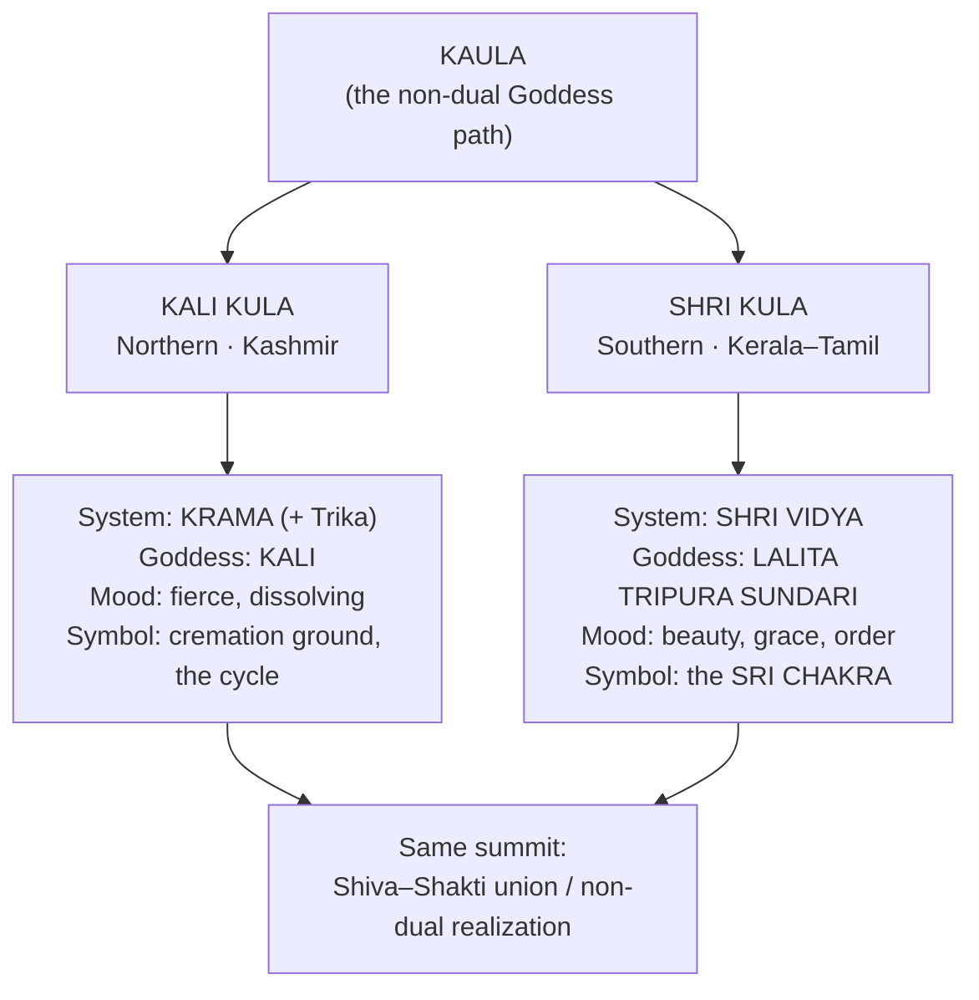

Both are **Kaula** at root and aim at the same non-dual realization; they differ in *temperament* and
in the *face of the Goddess* they approach. Both are often gathered under the 19th-century umbrella
term **"Kashmir Shaivism"** — principally the **Trika** and **Krama** schools, synthesised by
**Abhinavagupta** (10th–11th c.).

The Kaula signature: rather than *renouncing* body, senses, and desire, it **uses them** — "ritual,
the body, and sensory experience as a path to liberation." (This is the source of both Tantra's power
and its reputation for "left-hand" practices — see the caution in §16.)

---

## 7. Kali Kula — the Krama and the Fierce Goddess

### Kali

**Kali** ("She who is Time / the Dark One") is the fiercest, most direct face of the Goddess —
standing on Shiva, garlanded with severed heads, holding sword and severed head, yet also giving
fearlessness and boons. Read symbolically:

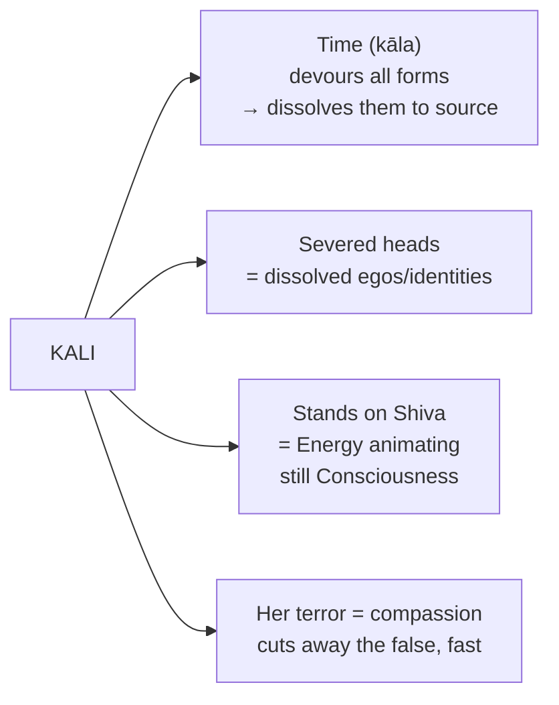

### The Krama system

**Krama** means "sequence / gradation / cycle." It is the Kali-centred school that maps reality and
realization as a **cyclic process** — the continuous flow of *emission → maintenance → withdrawal → the
nameless fourth* that grounds them. Each act of perception arising, being held, and dissolving is
Kali's dance — the very **pulse of awareness**.

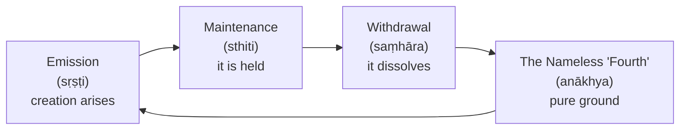

- Krama is "the cult of Kali," belonging to the **Kulamārga** (Kaula path).
- **Abhinavagupta** wove the Kali-based Krama into his Trika synthesis.
- Where Shri Vidya is geometric and serene, the Krama is **temporal and dynamic**.

The Kali Kula temperament suits seekers drawn to **radical dissolution**: facing death and ego-loss
directly, and finding the deathless awareness that remains.

---

## 8. Shri Vidya — the Sri Chakra and Lalita Tripura Sundari

**Shri Vidya** ("the auspicious wisdom") is the most refined and widely practised Goddess-Tantra,
especially in South India. Its Goddess is **Lalita Tripura Sundari** — "the Beautiful One of the
Three Worlds," also **Rajarajeshwari** ("Queen of queens") — sovereign of the physical, astral, and
causal realms.

### The Sri Chakra (Sri Yantra)

The **Sri Chakra** is a precise mandala of **nine interlocking triangles** (four upward = Shiva, five
downward = Shakti) inside lotus rings and gates, radiating from a central **bindu**.

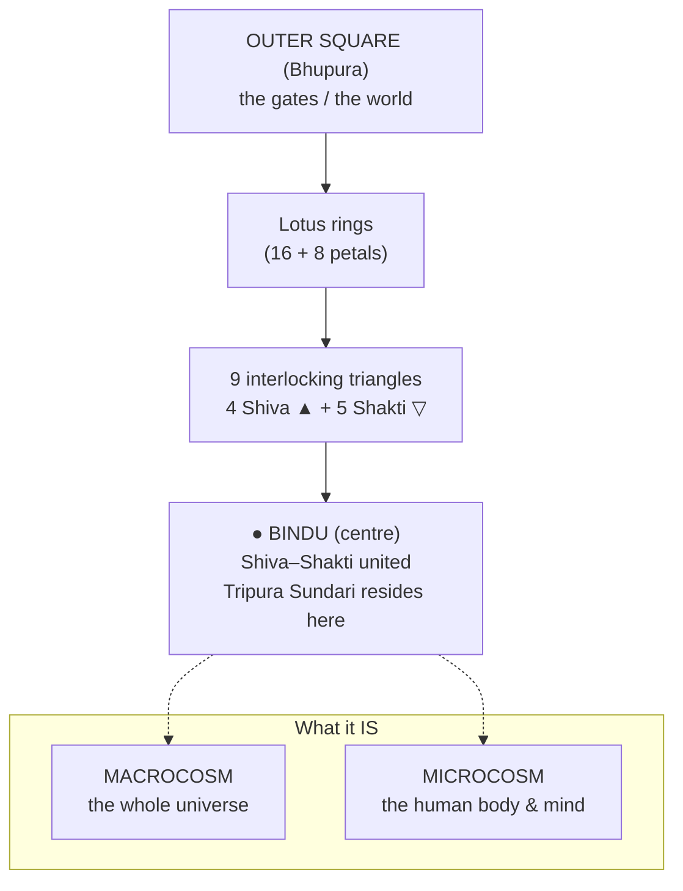

- It is at once the **map of the cosmos** and of the **human body/consciousness** —
  *yathā piṇḍe tathā brahmāṇḍe* ("as in the body, so in the universe").
- The Goddess resides in the central **bindu**; creation unfolds outward, and realization retraces the
  path inward, back to the center.
- It is worshipped via **Navavarana puja** — the "nine enclosures" (āvaraṇa), each hosting a family of
  yoginis, leading the worshipper inward to the bindu.

### The Panchadasi Mantra

The root mantra of Shri Vidya is the **Panchadasi** ("fifteen") — fifteen syllables in three groups
(**kutas**):

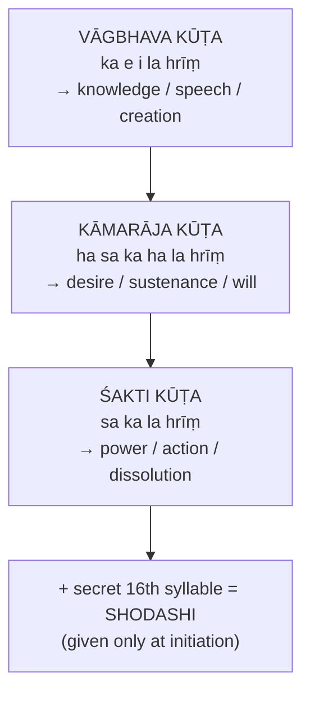

**These mantras are traditionally kept secret and taught only by a qualified guru** — the printed
syllables convey the letter, not the living transmission.

### Why Shri Vidya is prized

Among the Mahavidyas, Shri Vidya is singled out as granting **both worldly fulfilment (bhoga) and
liberation (moksha) through one mantra**, because Tripura Sundari inherently embodies the **union of
Shiva and Shakti** (see §17).

---

## 9. Devi and the Ten Mahavidyas

**Devi** ("the Goddess") is, in Shakta Tantra, the Absolute itself in feminine form — *Adi
Parashakti*, not merely a consort. She appears gentle (Parvati, Lakshmi, Saraswati), martial (Durga,
Chandi), and fierce (Kali, Chamunda).

The **Dasha Mahavidya** ("Ten Great Wisdoms") map the *full spectrum* of reality — creation and
destruction, beauty and terror, wealth and void. Each is a distinct doorway with its own mantra.

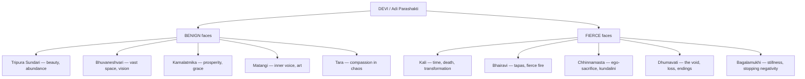

| # | Mahavidya | Essence / what she teaches |
|---|-----------|-----------------------------|
| 1 | **Kali** | Fierce transformation, time, death, ego-dissolution, courage |
| 2 | **Tara** | Compassionate guide across the chaos/void; the saving word |
| 3 | **Tripura Sundari** | Radiant beauty, abundance, harmony (the Shri Vidya goddess) |
| 4 | **Bhuvaneshvari** | Vast space, expansion of vision, the "world-mother" |
| 5 | **Bhairavi** | Tapas, discipline, fierce inner fire |
| 6 | **Chhinnamasta** | Self-sacrifice, ego-surrender, explosive kundalini |
| 7 | **Dhumavati** | Wisdom hidden in loss, endings, the void, the "widow" |
| 8 | **Bagalamukhi** | Stillness, stopping/mastering negativity and enemies |
| 9 | **Matangi** | The inner voice, raw authenticity, art, the "outcaste" wisdom |
| 10 | **Kamalatmika** | Prosperity, grace, sweetness (the Lotus/Lakshmi form) |

Together they say: *every* face of experience — even loss, terror, and death — is the Goddess, and
therefore a door home.

---

## 10. The Human Being: Five Koshas and Three Bodies

Before mapping energy centres, Vedanta and Tantra describe the human being as **five sheaths (pancha
kosha)** wrapped around the innermost Self (**Atman**). Classic source: **Taittiriya Upanishad
(2.1–5)**. Picture nested layers — an onion, or Russian dolls — each subtler than the last.

Here is the **pyramid / nesting** view (from gross outer surface down to the Self at the core):

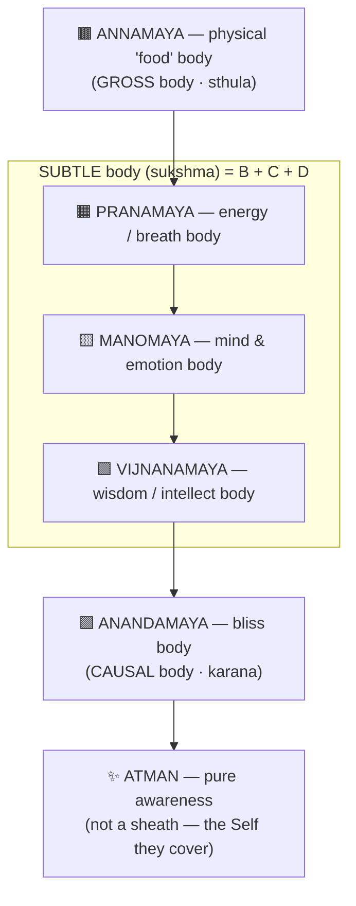

| Kosha | Meaning | What it is | Body |
|-------|---------|------------|------|
| **Annamaya** | "made of food" | the physical, flesh body | Gross (*sthula*) |
| **Pranamaya** | "made of prana" | the vital-energy / breath body | Subtle (*sukshma*) |
| **Manomaya** | "made of mind" | mind, emotion, sense-processing | Subtle |
| **Vijnanamaya** | "made of wisdom" | intellect, discernment (*buddhi*) | Subtle |
| **Anandamaya** | "made of bliss" | the causal bliss-sheath, deep peace | Causal (*karana*) |

**Beyond all five is the Atman** — pure, unchanging awareness — not a sheath but the one who *has* the
sheaths. Sadhana is the movement of attention **inward** through the koshas: body → breath → mind →
intellect → bliss → the witnessing Self. Tantra adds that this innermost Self is not separate from
Shiva–Shakti.

---

## 11. The Subtle Body: Nadis, Chakras, Granthis

The **Pranamaya kosha** has its own anatomy — a network channeling vital energy (*prana*).

### Nadis (channels)

Texts speak of **72,000 nadis**. Three matter most — and they behave like a caduceus:

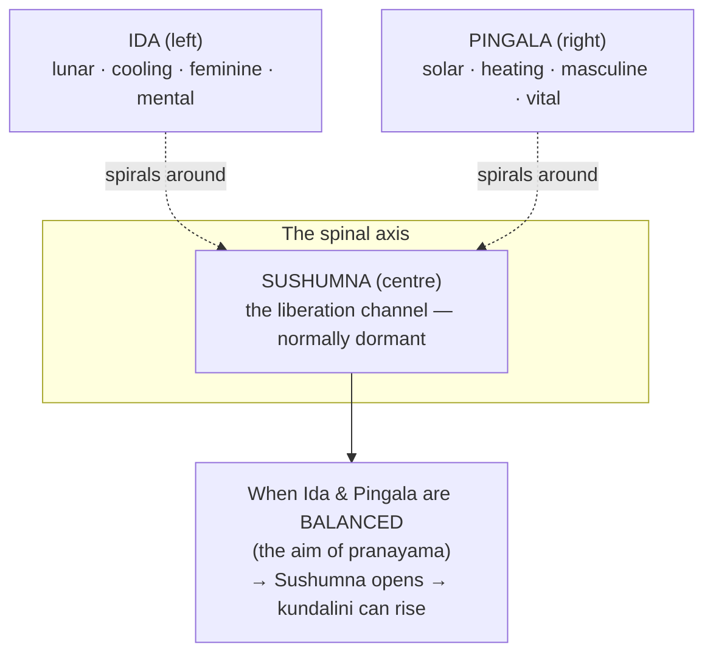

### The Seven Chakras (the ladder of the spine)

**Chakra** = "wheel" — a whirling centre where nadis converge, visualized as a lotus with a set number
of petals, an element, a seed-sound (**bija**), and associated faculties.

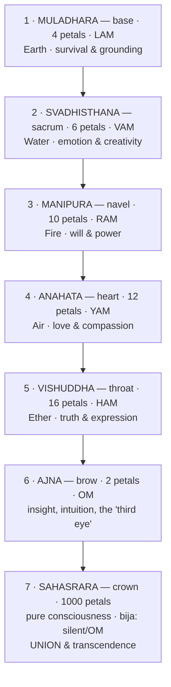

| # | Chakra | Location | Element | Bija | Petals | Colour | Theme |
|---|--------|----------|---------|------|--------|--------|-------|
| 1 | **Muladhara** | base of spine / perineum | Earth | **LAM** | 4 | red | survival, grounding |
| 2 | **Svadhisthana** | sacrum / lower abdomen | Water | **VAM** | 6 | orange | emotion, creativity |
| 3 | **Manipura** | navel / solar plexus | Fire | **RAM** | 10 | yellow | will, power, drive |
| 4 | **Anahata** | heart | Air | **YAM** | 12 | green | love, compassion |
| 5 | **Vishuddha** | throat | Ether/Space | **HAM** | 16 | blue | truth, expression |
| 6 | **Ajna** | between eyebrows | mind / light | **OM** | 2 | indigo | insight, intuition |
| 7 | **Sahasrara** | crown of head | pure consciousness | *(silent / "aḥ")* | 1000 | violet/white | union, transcendence |

*Notes:* the petal counts **4-6-10-12-16-2-1000** come from the *Sat-Cakra-Nirupana*; the 50 petals of
chakras 1–6 map to the 50 Sanskrit letters — all of sound strung along the spine. Sahasrara's "bija"
is disputed because it is held *beyond* sound (often silent, sometimes *aḥ* or OM). Ajna is where Ida,
Pingala, and Sushumna meet.

### The Three Granthis (psychic knots)

Along Sushumna sit three **granthis** ("knots") — dense conditioning that blocks kundalini and must be
pierced:

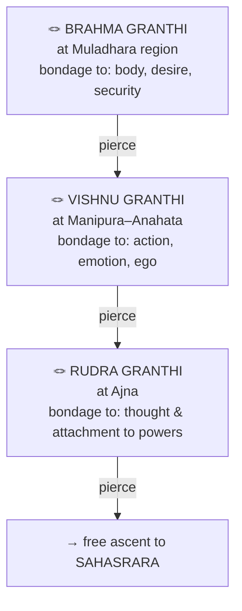

---

## 12. Kundalini Shakti

**Kundalini** ("the coiled one") is the concentrated form of Shakti lying dormant — coiled like a
serpent three-and-a-half times — at the base of the spine (**Muladhara**). She is the individual's
share of cosmic creative power, "asleep" while consciousness is bound to ordinary life.

The essence of Tantric/Hatha yoga is to **awaken** her and let her **rise through Sushumna**, piercing
the granthis and each chakra, until she reaches **Sahasrara** — where **Shakti reunites with Shiva**.

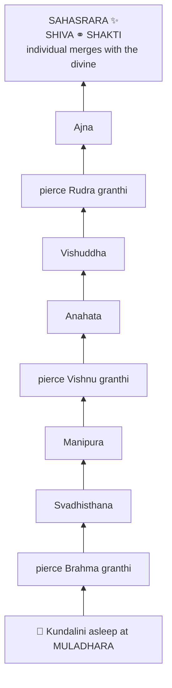

As kundalini rises, each centre's qualities are purified and awakened, and perception, energy, and
insight shift accordingly.

> **⚠ Why this is not a beginner's project.** Classical texts are emphatic: **do not force kundalini
> open.** Premature or ungrounded rousing — without ethics, a purified body, a steady mind, and a
> guru's guidance — is compared to *"a loaded firearm in the hands of a child."* Real awakening is the
> *result* of ripened practice, not a stunt. This is a main reason Tantra insists on a guru (§15) and
> on gradual sadhana (§16).

---

## 13. Patanjali's Ashtanga Yoga and its Relation to Kundalini/Tantra

**Patanjali's Yoga Sutras** codify **Raja Yoga** as **Ashtanga** — "eight limbs":

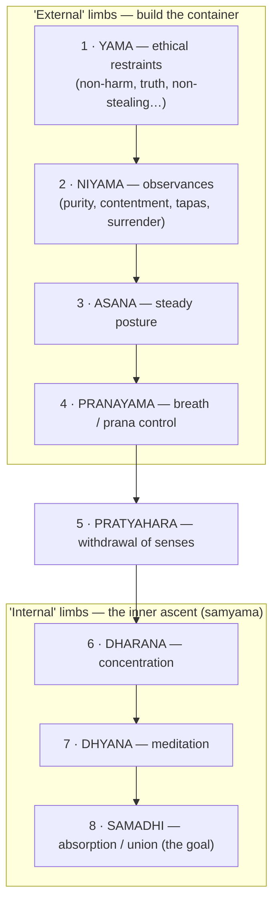

These are **not a strict ladder** but mutually reinforcing. The first two build the ethical container;
asana/pranayama prepare body and energy; pratyahara/dharana/dhyana train attention; samadhi is the
flowering.

### How it relates to Tantra and kundalini

Patanjali's system does **not** itself center chakras or kundalini — that vocabulary belongs to
**Tantra and Hatha Yoga**. But the two are **complementary**, and traditional practice weaves them:

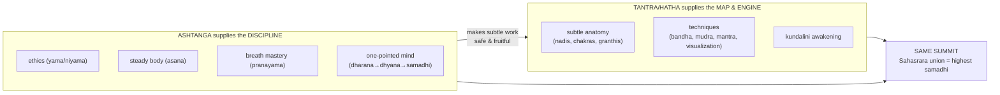

In effect: **pranayama balances Ida/Pingala → Sushumna opens; pratyahara + dharana turn attention
inward and upward; kundalini's arrival at Sahasrara is the Tantric name for what Patanjali calls the
highest samadhi.** Different vocabularies, same summit.

**Beginner takeaway:** *build the Ashtanga foundation first.* Ethics, steadiness, breath, and
concentration are the prerequisites that make everything downstream possible.

---

## 14. Mantra and the Beej (Seed) Mantras

**Mantra** (*man* "mind" + *tra* "to protect/instrument") is *sound as power*. In Tantra, sound is not
symbolic — it is a **vibrational form of Shakti**. Reality is understood as vibration (*spanda*); the
right sound, repeated with awareness, tunes the practitioner to a divine frequency.

### Bija (seed) mantras

A **bija** ("seed") is a single syllable that condenses the essence of a deity or energy — as a seed
contains the whole tree. They are the atoms of the mantric world.

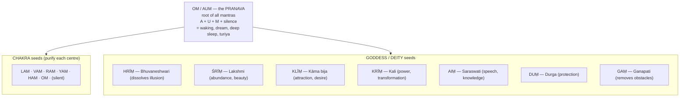

**Chakra bijas:** Muladhara **LAM** · Svadhisthana **VAM** · Manipura **RAM** · Anahata **YAM** ·
Vishuddha **HAM** · Ajna **OM** · Sahasrara *(silent / OM)*.
Popular attributions: LAM grounding · VAM creativity · RAM personal power · YAM love/compassion ·
HAM clear expression.

| Bija | Name | Associated with |
|------|------|-----------------|
| **OM / AUM** | Pranava | the primordial sound; the whole cosmos |
| **HRĪṂ** | Māyā bija | Bhuvaneshwari; dissolves illusion of good & evil |
| **ŚRĪṂ** | Lakshmi bija | beauty, abundance, wealth, wellbeing |
| **KLĪṂ** | Kāma bija | attraction, desire, love |
| **KRĪṂ** | Kali bija | power, transformation, dissolution |
| **AIṂ** | Vāgbhava bija | Saraswati; speech, knowledge, arts |
| **DUṂ** | | Durga; protection |
| **GAṂ** | | Ganapati; removing obstacles |

### How mantra is used

- **Japa** — repetition on a **mala** (108 beads): spoken (*vaikhari*), whispered (*upamshu*), or
  mental (*manasika*, considered highest).
- **Nyasa** — "placing" mantras/deities on the body to divinize it.
- **In puja & yantra worship** — invoking and vivifying the deity in image or diagram.

> **⚠ Important:** a *sadhana* mantra is meant to be received via **diksha** from a guru, who transmits
> not just syllables but the *living charge* (chaitanya). The bijas above are for *understanding*; for
> practice, seek proper initiation. General names (*Om Namah Shivaya*, *Om Namah Chandikayai*) are
> widely considered safe for open practice.

---

## 15. Guru–Shishya: Lineage and Diksha

Tantra is a **transmission tradition** — its deepest knowledge passes down a living chain, the
**guru–shishya parampara**.

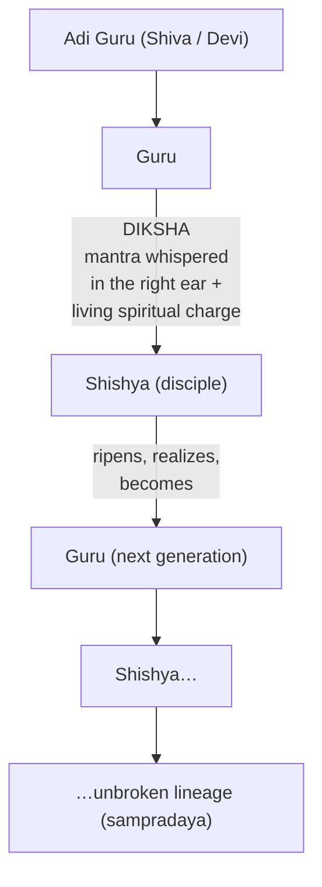

- **Parampara** ensures continuity of a **sampradaya** and the uncorrupted transmission of method and
  subtle knowledge across generations.
- The relationship rests on **the genuineness of the guru** and the **devotion, trust, discipline, and
  obedience of the disciple** — the best vehicle for knowledge that must be *calibrated to the
  individual* and corrected in real time.

### Diksha (initiation)

**Diksha** is the formal act by which the guru **accepts the disciple** and takes responsibility for
their progress. Its heart is usually **mantra diksha** — the guru gives the sadhana mantra
(traditionally whispered into the right ear), transmitting a *living spiritual charge*. Classical
Tantra recognizes grades of diksha (by touch, word, sight, or thought/*vedha* — direct energy
transmission).

### Why Tantra insists on a guru

- Many practices are **potent and, done wrong, harmful** (kundalini, fierce-deity sadhana, kaula
  rites); the guru provides **safety, correction, protection**.
- The guru embodies the **realized state** the disciple aims at — a living proof and mirror.
- Much is **secret (gupta)** by design, revealed only when the disciple is ready.

> **⚠ Caution for the modern seeker.** The guru's power is real, and so is the potential for abuse. A
> genuine guru shows realized conduct, transparent lineage, absence of exploitation (financial,
> sexual, coercive), and *encourages your discernment* — never demands you surrender it. Take time;
> verify lineage; trust your ethical instincts.

---

## 16. How to Start Sadhana

**Sadhana** (*sadh* "to accomplish") is disciplined spiritual practice — the daily work that ripens a
seeker (*sadhaka*) toward realization (*siddhi*). Tantra is emphatically a *doing* path.

### The classical progression (gross → subtle → formless)

```mermaid
flowchart LR
    S1["1 · MURTI SEVA<br/>worship of the form/image<br/>(external, devotional)"]
    S2["2 · JAPA & STUTI<br/>mantra + hymns<br/>(sound, internalizing)"]
    S3["3 · DHYANA–DHARANA<br/>concentration & meditation<br/>(attention turned inward)"]
    S4["4 · BRAHMA SADHANA<br/>abiding in the formless Absolute"]
    S1 --> S2 --> S3 --> S4
```

The movement mirrors the inward journey through the koshas (§10): **gross → subtle → formless.**

### Where a beginner should actually start

- **Begin with the name, not with advanced kriya.** The tradition prescribes **Nama Japa** for
  beginners: *"In Kaliyuga, japa is the feasible sadhana."* A new sadhaka should **not** begin with
  advanced Tantric kriya or any practice to *force* kundalini — again, *"a loaded firearm in a child's
  hands."*
- **Build the Ashtanga base** (§13): steady the body (asana/hatha); regulate breath (*nadi shodhana*
  to balance Ida/Pingala); turn attention inward.
- **Establish a daily rhythm.** Consistency at a fixed time and place beats intensity.

### The shape of a daily practice

```mermaid
flowchart TD
    P1["🚿 Prepare — bathe; fixed clean seat;<br/>face east/north; small altar"]
    P2["🧘 Asana — settle the body, then a steady seat"]
    P3["🌬 Pranayama — a few rounds of<br/>alternate-nostril breathing"]
    P4["🙏 Sankalpa — intention; invoke your<br/>ishta devata (chosen form)"]
    P5["📿 Japa — mantra on a mala (108×)<br/>spoken → whispered → mental"]
    P6["🕉 Dhyana — rest in meditation on breath /<br/>mantra's echo / the deity's form"]
    P7["✨ Close — gratitude & surrender; sit quietly"]
    P1 --> P2 --> P3 --> P4 --> P5 --> P6 --> P7
```

### Supports and discipline

- **Sattvic living** — light, pure food; classically *havishya* (simple boiled foods), fruits, milk
  during intensive practice; avoid what agitates the passions.
- **Brahmacharya** — moderation/continence, especially during intensive periods.
- **Ethical foundation** — truth, non-harm, contentment; without this the subtle work is unstable.
- **Regularity, patience, non-attachment to results.**

### The two roads: right-hand vs left-hand

```mermaid
flowchart TD
    ROOT["TANTRIC PRACTICE"]
    ROOT --> DAK["DAKSHINACHARA — 'right-hand'<br/>devotional, meditative, sattvic<br/>✅ where beginners start"]
    ROOT --> VAM["VAMACHARA — 'left-hand'<br/>ritually engages the forbidden<br/>(pancha-makara / 'five Ms')<br/>⚠ advanced · guru-only · usually symbolic/internalized"]
```

Vamachara is **advanced, guru-guided, lineage-specific, and heavily symbolic** — in most lineages the
substances/acts are substituted or internalized. **It is not a starting point** and is widely
misunderstood. Begin with the mainstream **Dakshinachara** path.

---

## 17. The Goal of Tantra: Bhukti and Mukti

Here Tantra states its boldest claim. Where ascetic paths demand you **renounce the world to attain
liberation**, Shakta Tantra promises **both**:

```mermaid
flowchart TD
    W["The world = Shakti<br/>(the Goddess's own body)"]
    W --> BH["BHUKTI / BHOGA<br/>enjoyment & mastery<br/>*within* the world"]
    W --> MK["MUKTI / MOKSHA<br/>liberation *from* bondage"]
    BH -->|"'Bhoga becomes Yoga'<br/>rightly engaged, enjoyment<br/>supports awakening"| U
    MK --> U["JIVANMUKTI<br/>liberation WHILE ALIVE<br/>Shiva ⚭ Shakti realized here & now"]
```

Tantra insists these are **not opposed**: "Bhoga becomes Yoga, vice becomes virtue, and the otherwise
enslaving world becomes the means to liberation." If the world is *Shakti*, then rightly engaged it is
not a trap but a **vehicle** — enjoyment pursued *consciously, ritually, offered to the Divine* becomes
worship and a support for awakening.

### Jivanmukti — liberation while living

The Tantric ideal is the **jivanmukta**: one **liberated while still embodied**. Realization is not
postponed to after death; the illusion "I am not yet free" is itself the only bondage, and its removal
*is* freedom — here, now, in this body.

### The realized goal, in Tantric terms

- **Union of Shiva and Shakti** — kundalini rejoining its source at the crown (§12), and recognizing
  that Consciousness and its Power were never two.
- **Recognition (pratyabhijñā)** — in Kashmir Shaivism, liberation is *recognizing* you were always
  Shiva; nothing is added, an error is undone.
- **Shri Vidya's synthesis** — worship of **Tripura Sundari**, who *is* the union, grants **both bhoga
  and moksha through a single mantra** (§8).

> **In one line:** *the goal of Tantra is to realize your identity with the undivided Shiva–Shakti —
> fully alive, fully embodied, fully free — so that living itself becomes liberation.*

---

## 18. A Beginner's Roadmap (Master Flowchart)

A sane, safe sequence — no forcing, no shortcuts. Follow the arrows; do not skip ahead.

```mermaid
flowchart TD
    START([Curiosity about Tantra]) --> STUDY["📖 1 · STUDY & ORIENT<br/>understand the worldview<br/>(this guide → reading list)"]
    STUDY --> ETHIC["⚖️ 2 · ETHICAL FOUNDATION<br/>yama / niyama — truth, non-harm,<br/>moderation, contentment"]
    ETHIC --> BODY["🧘 3 · BODY & BREATH<br/>hatha/asana + simple pranayama<br/>(alternate-nostril)"]
    BODY --> JAPA["📿 4 · DAILY JAPA & MEDITATION<br/>an open mantra (Om Namah Shivaya / OM)<br/>consistency over intensity"]
    JAPA --> DEV["❤️ 5 · DEVOTION & FORM<br/>choose an ishta devata you love"]
    DEV --> GURU{"🧑‍🏫 6 · Found a genuine<br/>guru in a living lineage?"}
    GURU -->|"not yet"| JAPA
    GURU -->|"yes — verified conduct & lineage"| DIKSHA["🔑 DIKSHA (initiation)<br/>receive a real sadhana mantra"]
    DIKSHA --> ADV["🌀 7 · ADVANCED PRACTICE<br/>Shri Vidya / kundalini / kaula<br/>— ONLY under guidance"]
    ADV --> GOAL([🕉 Jivanmukti<br/>Shiva–Shakti union · bhukti + mukti])

    CAUT["⚠ KEEP CLOSE:<br/>don't force kundalini · don't chase siddhis/experiences<br/>don't start with left-hand practice<br/>don't accept an exploitative teacher"]
    CAUT -.applies at every step.-> JAPA
```

**Patience, humility, and steadiness are the real *siddhis*.**

---

## 19. Glossary

- **Agama / Nigama** — revealed Tantric scripture (Shiva-taught / Shakti-taught).
- **Atman** — the innermost Self; pure awareness beyond the koshas.
- **Bhukti / Bhoga** — enjoyment, worldly fulfilment.
- **Bija** — seed (single-syllable) mantra.
- **Bindu** — the point; concentrated source-point of creation (center of the Sri Chakra).
- **Chakra** — subtle energy centre ("wheel") along the spinal axis.
- **Dakshinachara / Vamachara** — right-hand (devotional) / left-hand (transgressive) paths.
- **Diksha** — spiritual initiation by a guru.
- **Granthi** — psychic "knot" blocking kundalini (Brahma, Vishnu, Rudra).
- **Ida / Pingala / Sushumna** — left, right, and central nadis.
- **Ishta devata** — one's chosen/beloved form of the Divine.
- **Japa** — repetition of a mantra (often on a 108-bead mala).
- **Jivanmukti** — liberation while still alive and embodied.
- **Kaula / Kula** — the "clan/family" Tantric tradition; esoteric lineage.
- **Kosha** — sheath/layer of the self (five in number).
- **Krama** — the Kali-centred, "sequential/cyclic" school.
- **Kundalini** — the coiled Shakti at the base of the spine.
- **Mukti / Moksha** — liberation.
- **Nadi** — subtle energy channel (72,000 total).
- **Nyasa** — ritual "placing" of mantras/deity on the body.
- **Parampara** — teacher-to-disciple lineage/succession.
- **Prana** — vital life-energy.
- **Pratyabhijñā** — "recognition" (Kashmir Shaiva doctrine of realization).
- **Sadhana / Sadhaka / Siddhi** — practice / practitioner / attainment.
- **Samadhi** — meditative absorption/union (8th limb of Ashtanga).
- **Shakti / Shiva** — divine power-energy / pure consciousness.
- **Shri Vidya** — the Tripura-Sundari / Sri Chakra tradition (Shri Kula).
- **Spanda** — the divine "vibration/pulse" of consciousness.
- **Yantra** — a geometric diagram used in worship/meditation (e.g. Sri Chakra).

---

## 20. Reading List

**Accessible introductions & translations**
- *Tantra Illuminated* — Christopher Wallis: the best modern intro to non-dual Shaiva Tantra.
- *The Serpent Power* — Arthur Avalon (John Woodroffe): the *Sat-Cakra-Nirupana* + commentary (chakras,
  kundalini).
- *Shakti and Shakta* — John Woodroffe: broad overview of Shakta Tantra.
- *Vijnana Bhairava Tantra* — 112 meditation techniques (translations by Jaideva Singh, Lorin Roche).
- *The Yoga Sutras of Patanjali* — with commentary (Edwin Bryant; or Swami Satchidananda).

**Deeper / traditional**
- *Tantraloka* — Abhinavagupta (advanced; approach via Jaideva Singh's *Pratyabhijnahrdayam*).
- *Kularnava Tantra* & *Mahanirvana Tantra* — Kaula practice and ethics.
- *Saundarya Lahari* & *Tripura Rahasya* — Shri Vidya.
- *Devi Mahatmya* (Durga Saptashati) — the great Shakta hymn-narrative.
- *Taittiriya Upanishad* — source of the pancha-kosha teaching.

**On the subtle body / kundalini (with care)**
- *Kundalini: The Arousal of the Inner Energy* — Ajit Mookerjee.
- Himalayan Institute / Bihar School of Yoga materials on kundalini and nadis.

> For anything you intend to *practice* (not just study), work with a qualified teacher in a living
> lineage. See §15.

---

*Companion file: [`RAW-RESEARCH-NOTES.md`](./RAW-RESEARCH-NOTES.md) — source excerpts and links used to build this guide.*

*This guide is educational and descriptive. It synthesises widely available classical teachings and secondary scholarship; details (mantra syllables, counts, attributions) vary across lineages. Treat it as a map, not a manual — and for practice, seek a qualified guru.*
